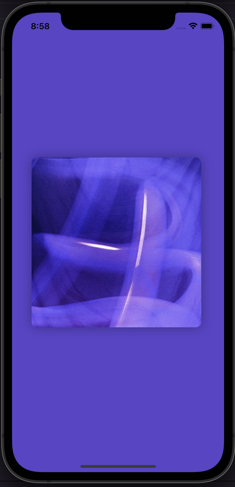
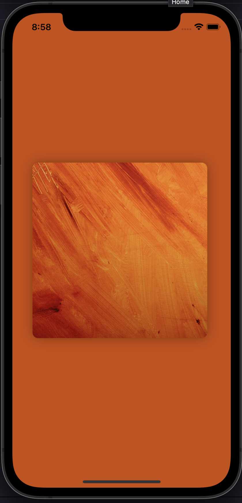
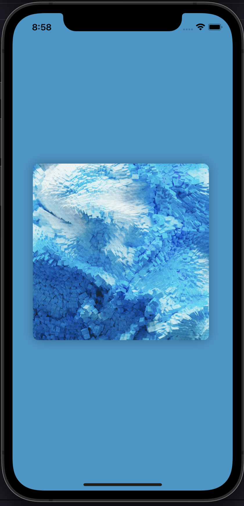

# Average Background Color

Es una aplicación escrita en SwiftUI 🚀.

Utililizando la extensión UIImage+Extension.swift podemos tomar el color principal de cada imágen y cambiar nuestro color de background.

## Requerimientos

- Swift 5.0+
- Xcode 13.0+
- iOS 15.0+ 

## ScreenShots 

| Home Violeta | Home Naranja  | Home Celeste|
| :-: | :-: | :-: |
|  |  |  | 

## Features

* SwiftUI Average Background color

  
## Author

* [**Maximiliano Morales**](https://github.com/maximorales90)

